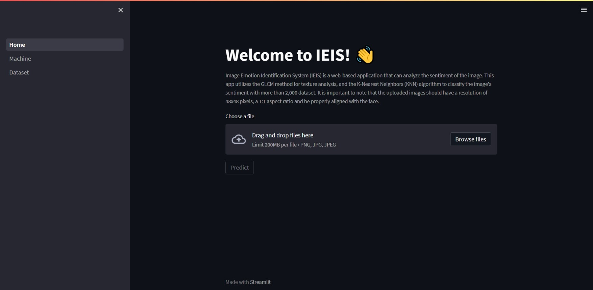

<a name="readme-top"></a>

<!-- ABOUT THE PROJECT -->

# IEIS (Image Emotion Identification System)



Image Emotion Identification System [(IEIS)](https://agungmahadana-ieis-home-odfm5c.streamlit.app/) is a web-based application that can analyze the sentiment of the image. This app utilizes the GLCM method for texture analysis, and the K-Nearest Neighbors (KNN) algorithm to classify the image's sentiment with more than 2,000 dataset. It is important to note that the uploaded images should have a resolution of 48x48 pixels, a 1:1 aspect ratio and be properly aligned with the face.

Use the `README.md` to get started.

<p align="right">(<a href="#readme-top">back to top</a>)</p>

## Built With

- 
- 

<p align="right">(<a href="#readme-top">back to top</a>)</p>

<!-- GETTING STARTED -->

## Installation

1. Clone the repo
   ```sh
   https://github.com/agungmahadana/IEIS.git
   ```
2. Build and clean
3. Run the app

<p align="right">(<a href="#readme-top">back to top</a>)</p>

<!-- CONTRIBUTING -->

## Contributing

Contributions are what make the open source community such an amazing place to learn, inspire, and create. Any contributions you make are **greatly appreciated**.

If you have a suggestion that would make this better, please fork the repo and create a pull request. You can also simply open an issue with the tag "enhancement".
Don't forget to give the project a star! Thanks again!

1. Fork the Project
2. Create your Feature Branch (`git checkout -b feature/AmazingFeature`)
3. Commit your Changes (`git commit -m 'Add some AmazingFeature'`)
4. Push to the Branch (`git push origin feature/AmazingFeature`)
5. Open a Pull Request

<p align="right">(<a href="#readme-top">back to top</a>)</p>

<!-- LICENSE -->

## License

Distributed under the MIT License. See [`LICENSE`](LICENSE) for more information.

<p align="right">(<a href="#readme-top">back to top</a>)</p>

<!-- ACKNOWLEDGMENTS -->

## Acknowledgments

- [Python](https://www.python.org/)
- [Streamlit](https://streamlit.io/)

<p align="right">(<a href="#readme-top">back to top</a>)</p>